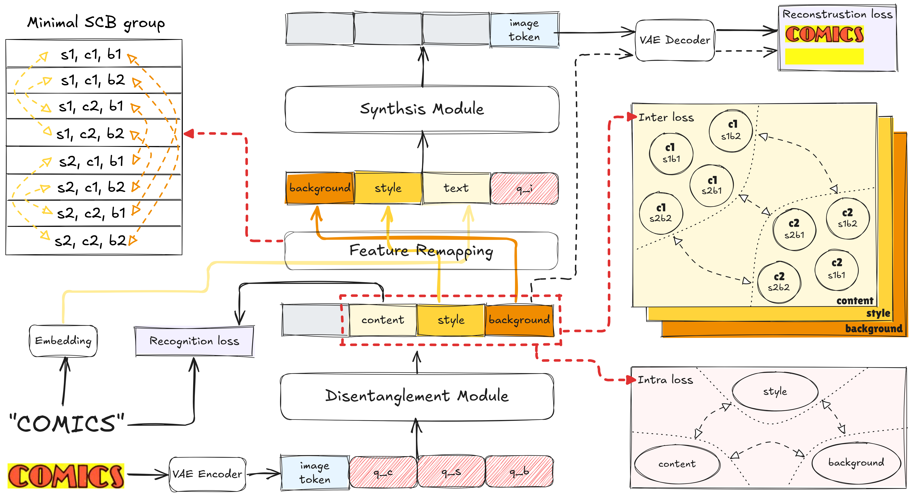
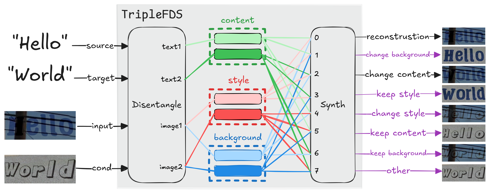

<h1 align="center"> <em>TripleFDS: Triple Feature Disentanglement and Synthesis for Scene Text Editing<br>
[AAAI 2026] </em></h1>

<p align="center">
<a href='https://arxiv.org/abs/2511.13399'></a>
<a href='https://github.com/yusenbao01/TripleFDS'></a>
</p>

<div align="center">

</div>

## 📝 Todo
- [x] Release the code of inference, training;
- [x] Release the code of SCB dataset construction;

## 🧱 0. Project Structure
The project is organized as follows:
```
TripleFDS/
├── SCB-Datagen/          # Synthetic data generation tool
│   ├── Synthtext/          # Text rendering modules
│   │   ├── gen.py          # Main generation logic
│   │   ├── data_cfg.py     # Data generation config
│   │   └── ...             
│   ├── datagen.py          # Main script
│   ├── cfg.py              # Dataset generation config
│   ├── generate_random_text.py
│   └── test_fonts.py       
├── configs/
│   ├── decouple_synth.yaml # Model and Dataset configuration
│   └── lightning.yaml      # Training configuration
├── data/
│   ├── dataset.py          # Datasets
│   └── alphabet/
│       ├── en.txt          # English alphabet
│       └── special_tokens.txt
├── model/
│   ├── model.py            # TripleFDS
│   ├── minGPT.py           # Core transformer model
│   ├── module.py           # Supporting modules
│   └── utils.py            
├── docs/                   
│   ├── TripleFDS.png       
│   ├── tasks.png           
│   ├── visualize.png       
│   └── ...
├── example/                # Example data for testing
│   └── 0/
│       ├── i_s/            # Source images
│       ├── i_s.txt         # Source text labels
│       └── i_t.txt         # Target text labels                  
├── main.py                 # Main training script
├── test.py                 # Script for content editing inference
├── test_flexibility.py     # Script for feature permutation inference
├── train.sh                
├── test.sh                 
├── requirements.txt        
└── README.md
```

## 🛠️ 1. Installation & Download
```bash
# CUDA Version: 12.2
conda create -n 3fds python=3.8
conda activate 3fds
pip install -r requirements.txt
```
```bash
# Install latent-diffusion for VAE
# https://github.com/CompVis/latent-diffusion.git
pip install -e latent-diffusion/
```
**Download Pre-trained VAE**: Download the [kl-f8.zip](https://ommer-lab.com/files/latent-diffusion/kl-f8.zip) and extract it to your desired location.


## 📦 2. SCB Dataset Construction
### 2.1. Material Preparation
To construct the SCB dataset, you need to prepare the following materials:
- **Background Images**: We recommend using [SceneVTG-Erase](https://modelscope.cn/datasets/Kpillow/SceneVTG-Erase) dataset, which provides high-quality text-erased images suitable for text synthesis.
- **Font Files**: Download diverse font collections from [Google Fonts](https://fonts.google.com/) to ensure variety in text styles.

Here is a recommended materials structure:
```
materials/
├── background/
│   └── <dataset_name>/
│       ├── train/
│       └── val/
└── fonts/
    ├── standard/
    │   └── arial.ttf
    ├── font1.ttf
    ├── font2.ttf
    ├── ...
    └── font999.ttf
```

### 2.2. Data Generation
The training data is generated synthetically using the `SCB-Datagen` tool.

1. **Configure Data Generation**:
    Edit `SCB-Datagen/cfg.py` and `SCB-Datagen/Synthtext/data_cfg.py` to set the desired parameters, such as the number of images, difficulty, and paths to background images and fonts. **Please replace all placeholder paths with your actual paths.**

2. **Run Data Generation**:
    ```bash
    cd SCB-Datagen
    python datagen.py
    ```

A normal SCB 2x2x2 dataset structure should be as follows **(both train and val sets share the same structure)**:
```
1.0*en-1m-8-middle/
├── train/
│   ├── 0000/
│   │   ├── # text images
│   │   ├── 0.png           # style 0, content 0, background 0
│   │   ├── 1.png           # style 0, content 0, background 1
│   │   ├── 2.png           # style 0, content 1, background 0
│   │   ├── 3.png           # style 0, content 1, background 1
│   │   ├── 4.png           # style 1, content 0, background 0
│   │   ├── 5.png           # style 1, content 0, background 1
│   │   ├── 6.png           # style 1, content 1, background 0
│   │   ├── 7.png           # style 1, content 1, background 1
│   │   │
│   │   ├── # background images
│   │   ├── bg0.png         # background 0
│   │   ├── bg1.png         # background 1
│   │   │
│   │   ├── # text masks
│   │   ├── mask0.png       # style 0, content 0
│   │   ├── mask1.png       # style 0, content 1
│   │   ├── mask2.png       # style 1, content 0
│   │   ├── mask3.png       # style 1, content 1
│   │   │
│   │   └── info.json       # Metadata (text content, font, etc.)
│   ├── 0001/
│   │   └── ...             
│   └── 9999/
│       └── ...             
└── val/
    ├── 0000/
    │   └── ...            
    └── .../
```

## 🔥 3. Training

### 3.1. Configuration
Before training, configure the following files:
-   **`configs/decouple_synth.yaml`**: Model parameters and dataset paths
-   **`configs/lightning.yaml`**: Trainer settings (VAE path, logging, checkpointing, etc.)

> **Important**: Replace all placeholder paths (e.g., `/path/to/your/...`) in the `.yaml` files with actual paths to your datasets and pretrained models.

### 3.2. Start Training
You can train the model using single or multiple GPUs:

```bash
# Single GPU training
python main.py --gpus 0 --use_adaptive_weight --disentanglement_weight 0.5

# Multi-GPU training (e.g., 4 GPUs)
python main.py --gpus 0,1,2,3 --use_adaptive_weight --disentanglement_weight 0.5
```


## 🎨 4. Inference
### 4.1. Task 1: Content Editing
Edit the text content in images while preserving the original style and background.

#### Data Preparation
Prepare your test data in the following structure:
```
example/
└── 0/
    ├── i_s/              # Source images directory
    │   ├── image1.jpg
    │   ├── image2.jpg
    │   └── ...
    └── i_t.txt           # Target text file (format: "image_name target_text")
```

#### Run Inference
```bash
python test.py \
    --resume <path_to_checkpoint> \
    --transformer_config <path_to_config> \
    --image_dir <path_to_image_directory> \
    --target_txt <path_to_target_text_file> \
    --image_h 64
```

#### Output Structure
Results will be saved in `output/edit_content_YYYYMMDD_HHMMSS`:
```
output/edit_content_YYYYMMDD_HHMMSS/
├── i_t/                  # Edited images
│   ├── image1.jpg
│   └── ...
└── concatenated/         # Visualization (original | background | edited)
    ├── image1.jpg
    └── ...
```


### 4.2. Task 2: Feature Permutation
Demonstrate the disentanglement capability by permuting style, content, and background features.
<div align="center">

</div>

#### Data Preparation
Prepare your test data with source images and labels:
```
example/
└── 0/
    ├── i_s/              # Source images directory
    │   ├── image1.jpg
    │   ├── image2.jpg
    │   └── ...
    └── i_s.txt           # Source text labels (format: "image_name text_content")
```

#### Run Inference
```bash
python test_flexibility.py \
    --resume <path_to_checkpoint> \
    --transformer_config <path_to_config> \
    --image_dir <path_to_image_directory> \
    --image_h 64
```


#### Output Structure
Results will be saved in `output/permutation_YYYYMMDD_HHMMSS`:
```
output/permutation_YYYYMMDD_HHMMSS/
└── pair_XXX_Y_Z.png      # Concatenated visualization (2 rows × 5 columns)
                          # Row 1: (s1,t1,b1), (s1,t1,b2), (s1,t2,b1), (s1,t2,b2), (s2,t1,b1)
                          # Row 2: (s2,t1,b2), (s2,t2,b1), (s2,t2,b2), b1, b2
                          # where s=style, t=content, b=background
```

> **Note**: Images are processed in pairs. The script automatically pairs consecutive images: (0,1), (2,3), (4,5), etc.


## 📊 5. Evaluation

### 5.1. Image Quality Metrics
To assess the visual quality of the edited images, we employ several standard metrics including **SSIM**, **PSNR**, **MSE**, and **FID**. For implementation details and evaluation scripts, please refer to [MOSTEL](https://github.com/qqqyd/MOSTEL) and [TextCtrl](https://github.com/weichaozeng/TextCtrl).

### 5.2. Text Recognition Accuracy
Text accuracy is measured using **ACC** and **NED** (Normalized Edit Distance). We recommend using the official implementation and pre-trained models from [deep-text-recognition-benchmark](https://github.com/clovaai/deep-text-recognition-benchmark) for consistent evaluation.


## 🙏 Acknowledgements
We sincerely thank the authors and contributors of the following projects, which have been instrumental to our work:
- [SRNet-Datagen](https://github.com/youdao-ai/SRNet-Datagen) - Synthetic data generation framework
- [MOSTEL](https://github.com/qqqyd/MOSTEL) - Evaluation metrics and benchmarks
- [SceneVTG](https://github.com/AlibabaResearch/AdvancedLiterateMachinery/tree/main/AIGC/SceneVTG) - Scene-text-free dataset
- [TextCtrl](https://github.com/weichaozeng/TextCtrl) - STE method and benchmarks
- [RS-STE](https://github.com/ZhengyaoFang/RS-STE) - STE method


## 📄 License
This project is licensed under the **MIT License**


## 📚 Citation
If you find TripleFDS useful in your research, please consider citing our paper:

```bibtex
@misc{bao2025triplefdstriplefeaturedisentanglement,
      title={TripleFDS: Triple Feature Disentanglement and Synthesis for Scene Text Editing}, 
      author={Yuchen Bao and Yiting Wang and Wenjian Huang and Haowei Wang and Shen Chen and Taiping Yao and Shouhong Ding and Jianguo Zhang},
      year={2025},
      eprint={2511.13399},
      archivePrefix={arXiv},
      primaryClass={cs.CV},
      url={https://arxiv.org/abs/2511.13399}, 
}
```